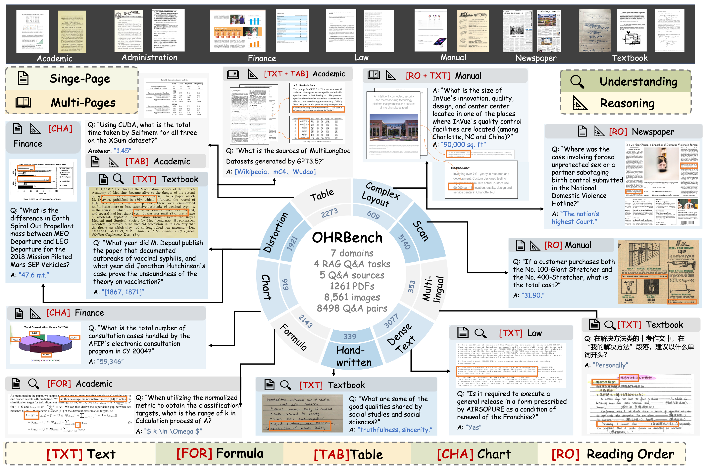

<h1 align="center">
    OCR Hinders RAG: Evaluating the Cascading Impact of OCR on Retrieval-Augmented Generation
</h1>

<div align="center">

[\[📜 arXiv\]](https://arxiv.org/abs/2412.02592v1) | [\[Dataset (🤗Hugging Face)\]](https://huggingface.co/datasets/opendatalab/OHR-Bench) | [\[Dataset (OpenDataLab)\]](https://opendatalab.com/OpenDataLab/OHR-Bench)

</div>

This repository contains the official code of **OHR-Bench**, a benchmark designed to evaluate the cascading impact of OCR on RAG.

# Overview
- **PDF, gt structured data and Q&A datasets: [[🤗 Hugging Face](https://huggingface.co/datasets/opendatalab/OHR-Bench)] `pdfs`, `gt_and_qas`**. It includes 4000+ unstructured PDF pages from various domains, including Textbook, Law, Finance, Newspaper, Manual and Academia and Q&A datasets sourced from multimodal document elements. Each PDF page is equipped with a human-verified ground truth structured data.
- **Perturbed data with OCR errors: [[🤗 Hugging Face](https://huggingface.co/datasets/opendatalab/OHR-Bench)] `retrieval_base/formatting_noise_[mild/moderate/severe]` and `retrieval_base/semantic_noise_[mild/moderate/severe]`**. In order to conduct in-depth analysis of the OCR's impact on RAG, OHR-Bench identifies *Semantic Noise* and *Formatting Noise* and introduce them with mild, moderate and severe perturbation based on real-world OCR errors.
- **Evaluation framework: [[Github opendatalab/OHR-Bench](GitHub - opendatalab/OHR-Bench: OCR Hinders RAG: Evaluating the Cascading Impact of OCR on Retrieval)]**. We provide a RAG evaluation framework to assess the impact of OCR processed structured data and our perturbed data on RAG including retrieval, generation and overall performance.



## Evaluation Results
<!--  -->
<table>
    <tr>
        <td></td>
        <td align="center">OCR</td>
        <td colspan="2" align="center">Retrieval</td>
        <td colspan="2" align="center">Generation</td>
        <td colspan="2" align="center">Overall</td>
    </tr>
    <tr>
        <td></td>
        <td>Edit Distance ↓</td>
        <td>LCS@1 ↑</td>
        <td>LCS@5 ↑</td>
        <td>EM ↑</td>
        <td>F1 ↑</td>
        <td>EM@1 ↑</td>
        <td>F1@1 ↑</td>
    </tr>
    <tr>
        <td>Ground Truth</td>
        <td>-</td>
        <td>63.53</td>
        <td>86.22</td>
        <td>33.54</td>
        <td>50.19</td>
        <td>26.42</td>
        <td>39.77</td>
    </tr>
    <tr>
    <td colspan="8"><em>Pipeline-based OCR</em></td>
    </tr>
    <tr>
        <td>MinerU</td>
        <td>0.2328</td>
        <td>52.53</td>
        <td><u>73.61</u></td>
        <td><b>30.50</b></td>
        <td><b>46.08</b></td>
        <td><b>24.52</b></td>
        <td><b>36.84</b></td>
    </tr>
    <tr>
        <td>Marker</td>
        <td>0.2621</td>
        <td><b>56.94</b></td>
        <td><b>78.53</b></td>
        <td><u>30.08</u></td>
        <td><u>46.02</u></td>
        <td><u>23.89</u></td>
        <td><u>36.51</u></td>
    </tr>
    <tr>
        <td>DeepDoc</td>
        <td>0.2839</td>
        <td>48.37</td>
        <td>68.94</td>
        <td>28.93</td>
        <td>44.12</td>
        <td>22.72</td>
        <td>34.55</td>
    </tr>
    <td colspan="8"><em>End-to-end OCR</em></td>
    <tr>
        <td>GOT</td>
        <td>0.2884</td>
        <td>45.80</td>
        <td>67.06</td>
        <td>26.36</td>
        <td>40.62</td>
        <td>21.51</td>
        <td>32.69</td>
    </tr>
    <tr>
        <td>Nougat</td>
        <td>0.3303</td>
        <td>44.77</td>
        <td>61.46</td>
        <td>24.81</td>
        <td>37.94</td>
        <td>20.40</td>
        <td>30.89</td>
    </tr>
    <td colspan="8"><em>Vision-Language Model for OCR</em></td>
    <tr>
        <td>Qwen2-VL-72B</td>
        <td>0.2564</td>
        <td><u>53.16</u></td>
        <td>72.97</td>
        <td>26.72</td>
        <td>41.23</td>
        <td>23.45</td>
        <td>35.91</td>
    </tr>
    <tr>
        <td>InternVL2-Llama3-76B</td>
        <td>0.4450</td>
        <td>42.43</td>
        <td>57.51</td>
        <td>20.74</td>
        <td>32.89</td>
        <td>20.58</td>
        <td>31.23</td>
    </tr>
</table>

We evaluate the suitability of current OCR solutions for real-world RAG applications by conducting comprehensive experiments with our OHR-Bench.
We derive conclusions as follows:

- Pipeline-based OCR demonstrates the best performance. Employing Marker achieves the best retrieval performance across all OCR solutions, while MinerU dominates the generation and overall evaluation.
- All OCR solutions suffer performance degradation. Even the best solutions show a decrease of 1.9 in EM@1 and 2.93 F1@1 in the overall evaluation, with greater losses in the retrieval and generation stages.

# Getting Started
## Installation
```bash
pip install -r requirements.txt
```

## Dataset preparation
### OCR processed structured data
To evaluate your RAG system on our benchmark, follow these steps:
1. **Download Perturbed Data**: Get the data with formatting and semantic noise from [the zip file in Hugging Face](https://huggingface.co/datasets/opendatalab/OHR-Bench/blob/main/retrieval.zip) and unzip it.
2. **Organize the Data**: Place the folders `retrieval_base/formatting_noise_[mild/moderate/severe]` and `retrieval_base/semantic_noise_[mild/moderate/severe]` in the `data/retrieval_base` directory of this project.
3. **Run Evaluation**: Follow the instructions in [**Run Evaluation**](#run-evaluation).

To evaluate your OCR results using this benchmark:
1. **Organize the Data**: Do OCR with your OCR models (PDFs available on [Hugging Face](https://huggingface.co/datasets/opendatalab/OHR-Bench)) and place the OCR processed structured data in the `data/retrieval_base` directory. Use the ground truth (`data/retrieval_base/gt`) data as an example. The sub-folder names indicate the domain of the parsed results, and each JSON file, named as the same of corresponding PDF files, should contain the corresponding parsed results.
2. **Run Evaluation**: Follow the instructions in [**Run Evaluation**](#run-evaluation).

<details>
<summary>Directory Structure</summary>

```bash
retrieval_base/gt/ # We provide gt and MinerU processed structured data as illustration here
├── finance # Domain
│   ├── 3M_2023Q2_10Q.json # Parsed results
│   ├── ...
├── textbook
...
```

</details>

<details>
<summary>OCR Processed Data</summary>

```json
[
    {
        "page_idx": 0, // Page index
        "text": "...", // OCR processed structured data
    },
    ...
]
```

</details>

### QA data
The qa data is placed in `data/qas.json`. Each JSON file should be structured as follows:

<details>
<summary>Q&A JSON</summary>

```json
[
    {
        "doc_name": "finance/JPMORGAN_2021Q1_10Q", // Document source
        "ID": "00073cc2-c801-467c-9039-fca63c78c6a9", // Unique ID
        "questions": "What was the total amount of nonaccrual loans retained as of March 31, 2021?",
        "answers": "842",
        "doc_type": "finance", // Q&A domain.
        "answer_form": "Numeric", // Answer format.
        "evidence_source": "table", // Evidence source.
        "evidence_context": "Nonaccrual loans retained $^{(\\mathrm{a})}$ & \\$ & 842 & \\$ & 689 & $22 \\%$", // Evidence.
        "evidence_page_no": 24
    },
    ...
]
```

</details>


## LLMs preparation
In `src/configs`, configure your local LLM path or GPT API.
```python
GPT_api_key = 'You KEY Here'  # openai.api_key
...
Qwen2_7B_local_path = 'Qwen/Qwen2-7B-Instruct' # download from Hugging Face or your local path
```


# Run Evaluation
To evaluate your OCR results, follow the instructions in the Dataset Preparation section to organize your OCR data.

```bash
# The first argument specifies which OCR results to use for evaluation.
# The second argument specifies the retrievers or LLMs.

# Args: Document source, LLM
# Generation with gt
bash shell/generation.sh gt qwen2_7b
# Generation with mild semantic noise
bash shell/generation.sh semantic_noise_mild qwen2_7b

# Args: Document source, retriver
# Retrieval with gt
bash shell/retrieval.sh gt bge-m3
# Retrieval with mild semantic noise
bash shell/retrieval.sh semantic_noise_mild bge-m3

# Args: Document source, retriver, LLM
# End-to-end with gt
bash shell/end2end.sh gt bge-m3 qwen2_7b
# End-to-end with mild semantic noise
bash shell/end2end.sh semantic_noise_mild bge-m3 qwen2_7b
```

# Acknowledgement
The evaluation framework is based on [CRUD](https://github.com/IAAR-Shanghai/CRUD_RAG), thanks so much for this brilliant project.

# Citation
```
@article{zhang2024ocr,
  title={OCR Hinders RAG: Evaluating the Cascading Impact of OCR on Retrieval-Augmented Generation},
  author={Junyuan Zhang and Qintong Zhang and Bin Wang and Linke Ouyang and Zichen Wen and Ying Li and Ka-Ho Chow and Conghui He and Wentao Zhang},
  journal={arXiv preprint arXiv:2412.02592},
  year={2024}
}
```

# Copyright Statement
The PDFs are collected from public online channels and community user contributions. Content that is not allowed for distribution has been removed. The dataset is for research purposes only and not for commercial use. If there are any copyright concerns, please contact OpenDataLab@pjlab.org.cn.
